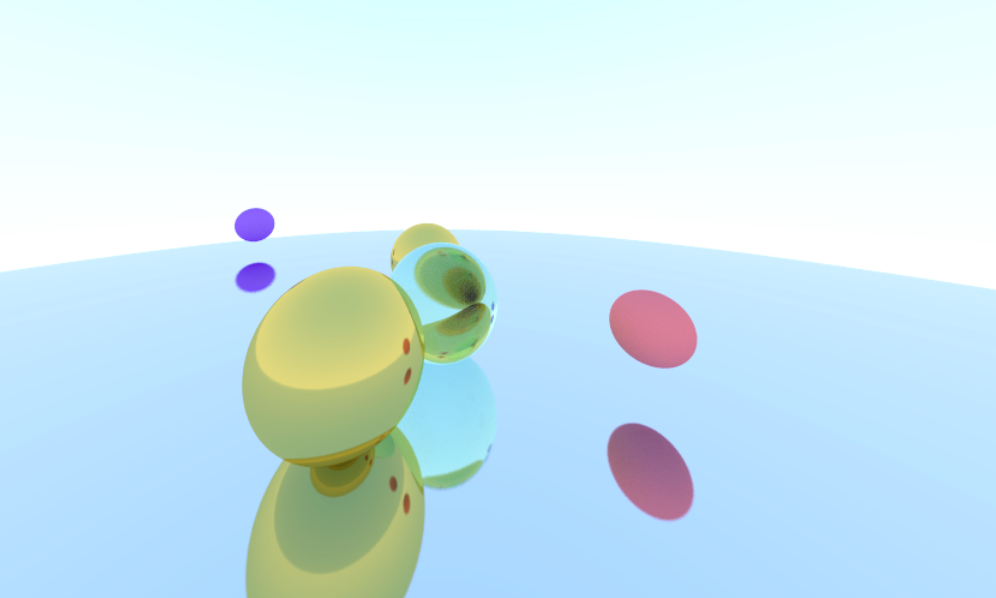
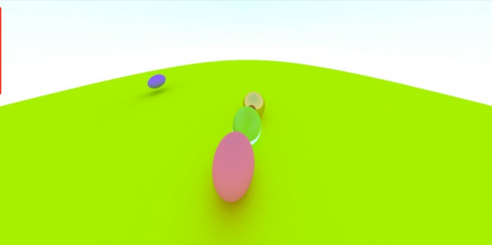

# Raytracer
This repository stores a raytracer written in C++. The following features are noteworthy:
* Ambient lighting
* A material interface, with implementation of matte, metal and translucent materials
* A hitable interface to abstract objects that can be hit by light
* Sphere class as an implementation of hitable
* A movable camera with control on resolution, FOV, roll, position and direction

 


## Running instructions 
Clone this repository locally, preferably on a Linux machine.
Then in the working directory, run:
```
$ g++ *.cpp -o executable
$ ./executable
```
To generate different images, the user can alter the lookfrom, look to and other
camera properties in main.cpp. The set of objects can be altered by creating more instances
in the world list.

